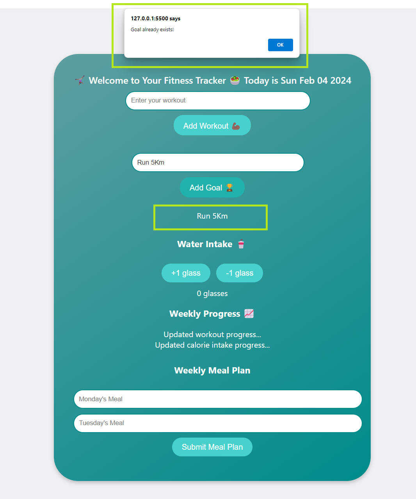

# [JSL02]: Debug the DOM

# Debugging Duplicate Goals

## Overview
The project focuses on addressing an issue where users have the ability to add the same fitness goal multiple times, leading to duplicate entries within the goal list. The primary objective is to enhance the user experience by preventing the occurrence of duplicates. This is achieved through the implementation of a check that ensures the same fitness goal cannot be added more than once. Upon detection of a duplicate goal, it should be excluded from the list.

## 
### Objective:
 The main goal of the project is to prevent the addition of duplicate fitness goals to the list, thereby improving the overall user experience.
### Implementation: 
The project involves implementing a check within the system to verify if the fitness goal being added already exists in the list before appending it, thereby preventing the addition of duplicate entries.
### User Feedback:
 In order to provide clear feedback to users, the project also focuses on displaying an alert to inform the user if they are attempting to add a duplicate goal.
### Focus:
 The primary focus of the project is on the code structure within the system and the development of a robust mechanism to handle and prevent the addition of duplicate fitness goals.
## 📚 What I Learned
In this project, I learned the importance of preventing duplicate entries within a system and how to enhance the user experience by implementing a check to ensure that the same fitness goal cannot be added more than once. Additionally, I gained insight into the significance of providing clear and informative feedback to users by displaying an alert when attempting to add a duplicate goal.